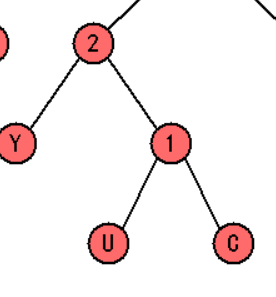
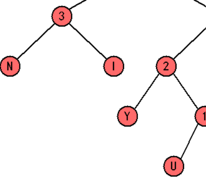
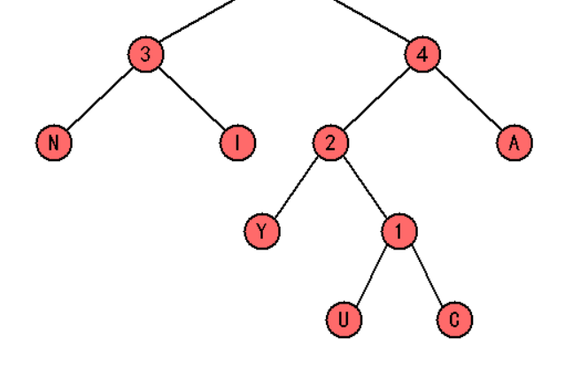
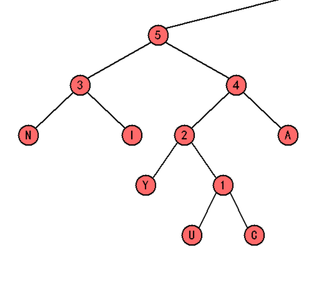
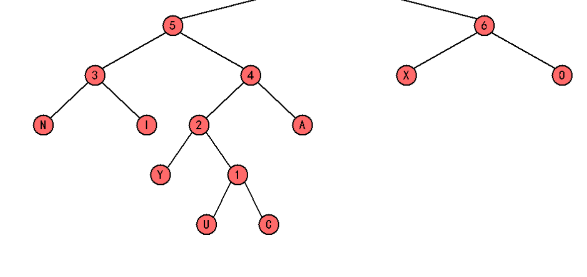
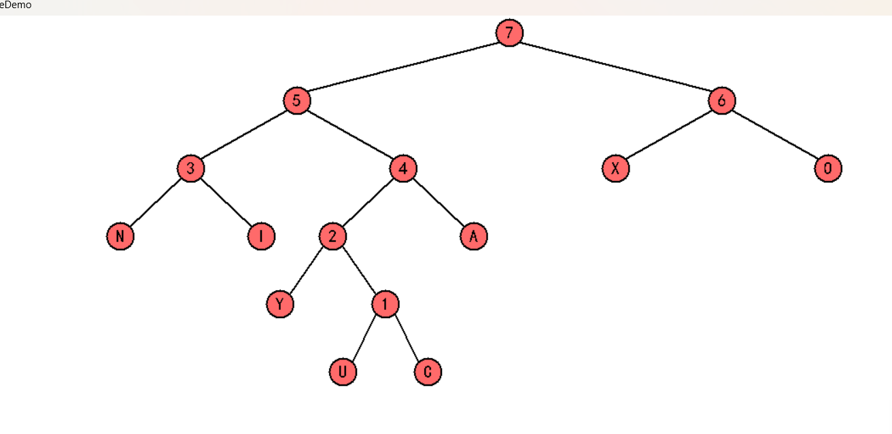
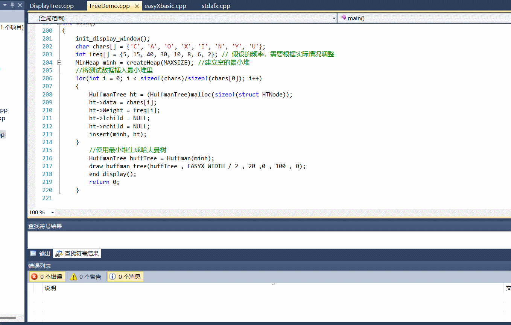

## 简要介绍哈夫曼树的概念和应用

**引言**：为了方便读者观察哈夫曼树的构建过程，代码中添加了比较多的打印调试信息，也希望读者在调试程序时，能够多打印调试信息，学会根据调试信息来观察程序运行状况，提升调试效率。

#### **哈夫曼树构建步骤**：

##### **步骤1**：确定字符集和频率。选择您的姓名全拼中的所有字母（去重），并为每个字符分配一个自定义的频率。

```c
int main() {
    // ... 其他代码 ...
// 假设的字符集，应该是您的姓名全拼中的所有字母（去重）
char chars[] = {'C', 'A', 'O', 'X', 'I', 'N', 'Y', 'U'};

// 假设的频率，需要根据实际情况调整
int freq[] = {5, 15, 40, 30, 10, 8, 6, 2}; // 这里的频率是自定义的

// ... 其他代码 ...

// 建立空的最小堆
MinHeap minh = createHeap(MAXSIZE); // 这里的 MAXSIZE 应该是一个定义好的常量，表示堆的最大容量

// 将测试数据插入最小堆里
for (int i = 0; i < sizeof(chars) / sizeof(chars[0]); i++) {
    HuffmanTree ht = (HuffmanTree)malloc(sizeof(struct HTNode));
    ht->data = chars[i];
    ht->Weight = freq[i];
    ht->lchild = NULL;
    ht->rchild = NULL;
    insert(minh, ht);
}

// ... 其他代码 ...
```
}

##### **步骤2**：创建初始最小堆。展示最小堆的初始状态，包括哨兵节点和每个字符节点。

```c
// 创建一个空的最小堆，长度为maxSize`
MinHeap createHeap(int maxSize) {`
    MinHeap H = (MinHeap)malloc(sizeof(struct HNode));  // 为堆中的数组分配内存`
    H->data = (HuffmanTree *)malloc((maxSize + 1) * sizeof(HuffmanTree)); // 堆的数据为哈夫曼树`
    H->size = 0;`
    H->capacity = maxSize;
                                 
HuffmanTree t = (HuffmanTree)malloc(sizeof(struct HTNode)); // 创建哈夫曼树节点
t->data = '!'; // 哨兵节点，通常用一个特殊字符表示
t->Weight = 0;
H->data[0] = t; // 堆中数组[0]用作哨兵，指向哈夫曼树节点

printf("创建空的最小堆，容量%d 当前元素数量 %d ，哈夫曼树节点哨兵的权%d \n", H->capacity, H->size, H->data[0]->Weight);
return H;
}
```

接下来，您需要将字符和它们的频率插入到这个最小堆中。这在 `main` 函数中通过循环完成，如下所示：

```c
// 将测试数据插入最小堆里
for (int i = 0; i < sizeof(chars) / sizeof(chars[0]); i++) {
    HuffmanTree ht = (HuffmanTree)malloc(sizeof(struct HTNode));
    ht->data = chars[i];
    ht->Weight = freq[i];
    ht->lchild = NULL;
    ht->rchild = NULL;
    insert(minh, ht);
}
```

##### **步骤3**：构建哈夫曼树。详细描述如何通过合并最小堆中的两个最小节点来构建哈夫曼树，直到堆中只剩下一个节点。

```c
// 根据minh内最小堆的内容，构建一个哈夫曼树
HuffmanTree Huffman(MinHeap minh) {
    int i;
    HuffmanTree T;

    BuildHeap(minh); // 将H构建为一个最小堆
    int n = minh->size;
    for (i = 1; i < n; i++) {
        // 做minh->size - 1次合并
        T = (HuffmanTree)malloc(sizeof(struct HTNode)); // 初始化新节点
        T->lchild = deleteMin(minh); // 从最小堆中删除一个节点，作为新T的左子节点
        T->rchild = deleteMin(minh); // 从最小堆中删除一个节点，作为新T的右子节点

        T->Weight = T->lchild->Weight + T->rchild->Weight; // 新T的权值等于两个子节点权值之和
        T->data = '0' + i; // 这里假设新节点的数据域用于标记，实际应用中可能需要其他方式
        insert(minh, T); // 将新节点插入最小堆
    }
    T = deleteMin(minh); // 最小堆中剩下的结点就是哈夫曼树
    return T;
}
```

去除printf打印信息，观察该树

```c
int main() {
    // 初始化显示窗口，这可能是 easyX 图形库的函数，用于创建图形界面
    init_display_window();
    
    // 定义字符集，应该是您的姓名全拼中的所有字母（去重）
    char chars[] = {'C', 'A', 'O', 'X', 'I', 'N', 'Y', 'U'};
    
    // 定义每个字符的频率，这些频率是自定义的
    int freq[] = {5, 15, 40, 30, 10, 8, 6, 2};
    
    // 建立空的最小堆，MAXSIZE 应该是一个定义好的常量，表示堆的最大容量
    MinHeap minh = createHeap(MAXSIZE);
    
    // 将测试数据插入最小堆里
    for (int i = 0; i < sizeof(chars) / sizeof(chars[0]); i++) {
        HuffmanTree ht = (HuffmanTree)malloc(sizeof(struct HTNode));
        ht->data = chars[i];
        ht->Weight = freq[i];
        ht->lchild = NULL;
        ht->rchild = NULL;
        insert(minh, ht);
    }
    
    // 使用最小堆生成哈夫曼树
    HuffmanTree huffTree = Huffman(minh);
    
    // 绘制哈夫曼树，这可能是 easyX 图形库的函数，用于在图形界面上显示哈夫曼树
    draw_huffman_tree(huffTree, EASYX_WIDTH / 2, 20, 0, 100, 0);
    
    // 结束显示，这可能是 easyX 图形库的函数，用于关闭图形界面
    end_display();
    
    return 0;
}
```

#### **图文展示**：

展示最小堆的内容变化和哈夫曼树的构建过程：

##### 第一次循环构建哈夫曼树的过程：

1. **初始化最小堆**：首先，通过 `createHeap` 函数创建一个空的最小堆，并设置哨兵节点，其 `data` 为 `'!'`，`Weight` 为 `0`。
2. **插入节点**：在 `main` 函数中，定义字符数组 `chars` 和对应的频率数组 `freq`。然后，通过循环，为每个字符创建 `HuffmanTree` 结点，并使用 `insert` 函数将其插入到最小堆中。
3. **构建最小堆**：在 `Huffman` 函数中，首先调用 `BuildHeap` 函数，对已经插入所有节点的最小堆进行调整，确保最小堆的性质。这是通过从最后一个有孩子的节点开始，对所有有孩子的节点进行下滤操作实现的。
4. **第一次循环**：在 `Huffman` 函数中，开始构建哈夫曼树的循环。循环的第一次迭代如下：
   - **删除最小节点**：使用 `deleteMin` 函数删除最小堆中的最小节点（`'U'`，权 `2`），这个节点将成为新创建的内部节点的左子节点。
   - **打印最小堆**：调用 `printHeap` 函数，打印当前最小堆的状态。
   - **删除次小节点**：再次使用 `deleteMin` 函数删除次小的节点（`'Y'`，权 `6`），这个节点将成为新创建的内部节点的右子节点。
   - **创建新节点**：创建一个新的内部节点，其 `Weight` 为两个子节点权值之和（`2 + 6 = 8`），`data` 为 `'1'`（表示这是第一次循环）。
   - **插入新节点**：使用 `insert` 函数将新创建的内部节点插入到最小堆中。
   - **打印最小堆**：再次调用 `printHeap` 函数，打印当前最小堆的状态。
5. **循环后最小堆的状态**：第一次循环后，最小堆的状态将如下变化：
   - 位置0，字符！，权0（哨兵节点）
   - 位置1，新节点，字符'1'，权8（由'U'和'Y'合并而成）
   - 位置2，字符N，权8
   - 位置3，字符C，权5
   - 位置4，字符I，权10
   - 位置5，字符A，权15
   - 位置6，字符X，权30
   - 位置7，字符O，权40


##### 第二次循环构建哈夫曼树的过程：

1. **开始第二次循环**：在 `Huffman` 函数中，循环变量 `i` 自增，开始第二次循环。

2. **删除最小节点**：使用 `deleteMin` 函数删除当前最小堆中的最小节点。假设第一次循环后最小堆的状态如下：

   - 位置0，字符！，权0（哨兵节点）
   - 位置1，新节点，字符'1'，权8
   - 位置2，字符N，权8
   - 位置3，字符C，权5
   - 位置4，字符I，权10
   - 位置5，字符A，权15
   - 位置6，字符X，权30
   - 位置7，字符O，权40

   在第二次循环开始时，`deleteMin` 会删除位置1的节点（字符'1'，权8），这个节点将成为新创建的内部节点的左子节点。

3. **打印最小堆**：调用 `printHeap` 函数，打印当前最小堆的状态。

4. **删除次小节点**：再次使用 `deleteMin` 函数删除新的最小节点，即位置2的节点（字符N，权8），这个节点将成为新创建的内部节点的右子节点。

5. **创建新节点**：创建一个新的内部节点，其 `Weight` 为两个子节点权值之和（`8 + 8 = 16`），`data` 为 `'2'`（表示这是第二次循环）。

6. **插入新节点**：使用 `insert` 函数将新创建的内部节点插入到最小堆中。

7. **打印最小堆**：再次调用 `printHeap` 函数，打印当前最小堆的状态。

8. **循环后最小堆的状态**：第二次循环后，最小堆的状态将如下变化：

   - 位置0，字符！，权0（哨兵节点）
   - 位置1，新节点，字符'2'，权16（由第一次循环的节点'1'和字符N合并而成）
   - 位置2，字符C，权5
   - 位置3，字符I，权10
   - 位置4，字符A，权15
   - 位置5，字符X，权30
   - 位置6，字符O，权40



##### 第三次循环构建哈夫曼树的过程：

1. **开始第三次循环**：在 `Huffman` 函数中，循环变量 `i` 自增，开始第三次循环。

2. **删除最小节点**：使用 `deleteMin` 函数删除当前最小堆中的最小节点。假设第二次循环后最小堆的状态如下：

   - 位置0，字符！，权0（哨兵节点）
   - 位置1，新节点，字符'2'，权16
   - 位置2，字符C，权5
   - 位置3，字符I，权10
   - 位置4，字符A，权15
   - 位置5，字符X，权30
   - 位置6，字符O，权40

   在第三次循环开始时，`deleteMin` 会删除位置2的节点（字符C，权5），这个节点将成为新创建的内部节点的左子节点。

3. **打印最小堆**：调用 `printHeap` 函数，打印当前最小堆的状态。

4. **删除次小节点**：再次使用 `deleteMin` 函数删除新的最小节点，即位置3的节点（字符I，权10），这个节点将成为新创建的内部节点的右子节点。

5. **创建新节点**：创建一个新的内部节点，其 `Weight` 为两个子节点权值之和（`5 + 10 = 15`），`data` 为 `'3'`（表示这是第三次循环）。

6. **插入新节点**：使用 `insert` 函数将新创建的内部节点插入到最小堆中。

7. **打印最小堆**：再次调用 `printHeap` 函数，打印当前最小堆的状态。

8. **循环后最小堆的状态**：第三次循环后，最小堆的状态将如下变化：

   - 位置0，字符！，权0（哨兵节点）
   - 位置1，新节点，字符'3'，权15（由字符C和字符I合并而成）
   - 位置2，字符A，权15
   - 位置3，字符'2'，权16
   - 位置4，字符X，权30
   - 位置5，字符O，权40



##### 第四次循环构建哈夫曼树的过程：

1. **开始第四次循环**：在 `Huffman` 函数中，循环变量 `i` 自增，开始第四次循环。

2. **删除最小节点**：使用 `deleteMin` 函数删除当前最小堆中的最小节点。假设第三次循环后最小堆的状态如下：

   - 位置0，字符！，权0（哨兵节点）
   - 位置1，新节点，字符'3'，权15
   - 位置2，字符A，权15
   - 位置3，字符'2'，权16
   - 位置4，字符X，权30
   - 位置5，字符O，权40

   在第四次循环开始时，`deleteMin` 会删除位置1的节点（字符'3'，权15），这个节点将成为新创建的内部节点的左子节点。

3. **打印最小堆**：调用 `printHeap` 函数，打印当前最小堆的状态。

4. **删除次小节点**：再次使用 `deleteMin` 函数删除新的最小节点，即位置2的节点（字符A，权15），这个节点将成为新创建的内部节点的右子节点。

5. **创建新节点**：创建一个新的内部节点，其 `Weight` 为两个子节点权值之和（`15 + 15 = 30`），`data` 为 `'4'`（表示这是第四次循环）。

6. **插入新节点**：使用 `insert` 函数将新创建的内部节点插入到最小堆中。

7. **打印最小堆**：再次调用 `printHeap` 函数，打印当前最小堆的状态。

8. **循环后最小堆的状态**：第四次循环后，最小堆的状态将如下变化：

   - 位置0，字符！，权0（哨兵节点）
   - 位置1，新节点，字符'4'，权30（由字符'3'和字符A合并而成）
   - 位置2，字符'2'，权16
   - 位置3，字符X，权30
   - 位置4，字符O，权40



##### 第五次循环构建哈夫曼树的过程：

1. **开始第五次循环**：在 `Huffman` 函数中，循环变量 `i` 自增，开始第五次循环。

2. **删除最小节点**：使用 `deleteMin` 函数删除当前最小堆中的最小节点。假设第四次循环后最小堆的状态如下：

   - 位置0，字符！，权0（哨兵节点）
   - 位置1，新节点，字符'4'，权30
   - 位置2，字符'2'，权16
   - 位置3，字符X，权30
   - 位置4，字符O，权40

   在第五次循环开始时，`deleteMin` 会删除位置2的节点（字符'2'，权16），这个节点将成为新创建的内部节点的左子节点。

3. **打印最小堆**：调用 `printHeap` 函数，打印当前最小堆的状态。

4. **删除次小节点**：再次使用 `deleteMin` 函数删除新的最小节点，即位置1的节点（字符'4'，权30），这个节点将成为新创建的内部节点的右子节点。

5. **创建新节点**：创建一个新的内部节点，其 `Weight` 为两个子节点权值之和（`16 + 30 = 46`），`data` 为 `'5'`（表示这是第五次循环）。

6. **插入新节点**：使用 `insert` 函数将新创建的内部节点插入到最小堆中。

7. **打印最小堆**：再次调用 `printHeap` 函数，打印当前最小堆的状态。

8. **循环后最小堆的状态**：第五次循环后，最小堆的状态将如下变化：

   - 位置0，字符！，权0（哨兵节点）
   - 位置1，新节点，字符'5'，权46（由字符'2'和字符'4'合并而成）
   - 位置2，字符X，权30
   - 位置3，字符O，权40



##### 第六次循环构建哈夫曼树的过程：

1. **开始第六次循环**：在 `Huffman` 函数中，循环变量 `i` 自增，开始第六次循环。

2. **删除最小节点**：使用 `deleteMin` 函数删除当前最小堆中的最小节点。假设第五次循环后最小堆的状态如下：

   - 位置0，字符！，权0（哨兵节点）
   - 位置1，新节点，字符'5'，权46
   - 位置2，字符X，权30
   - 位置3，字符O，权40

   在第六次循环开始时，`deleteMin` 会删除位置2的节点（字符X，权30），这个节点将成为新创建的内部节点的左子节点。

3. **打印最小堆**：调用 `printHeap` 函数，打印当前最小堆的状态。

4. **删除次小节点**：再次使用 `deleteMin` 函数删除新的最小节点，即位置3的节点（字符O，权40），这个节点将成为新创建的内部节点的右子节点。

5. **创建新节点**：创建一个新的内部节点，其 `Weight` 为两个子节点权值之和（`30 + 40 = 70`），`data` 为 `'6'`（表示这是第六次循环）。

6. **插入新节点**：使用 `insert` 函数将新创建的内部节点插入到最小堆中。

7. **打印最小堆**：再次调用 `printHeap` 函数，打印当前最小堆的状态。

8. **循环后最小堆的状态**：第六次循环后，最小堆的状态将如下变化：

   - 位置0，字符！，权0（哨兵节点）
   - 位置1，新节点，字符'6'，权70（由字符X和字符O合并而成）



##### 最终结果：



##### 动画演示：


